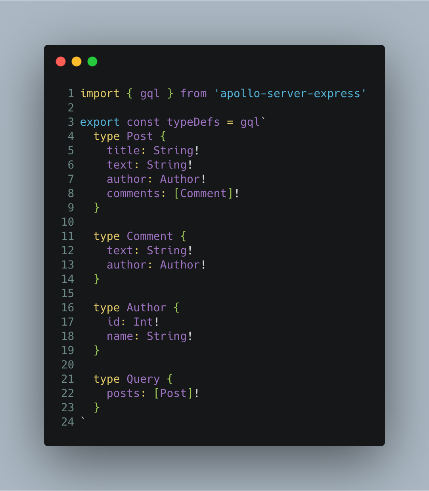
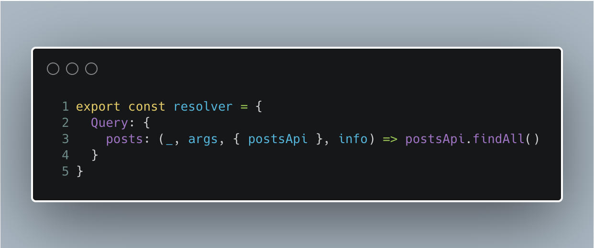

<!--
****WELCOME****

Welcome. Thanks everyone for coming to this CharlestonJS Meetup. I hope everyone got along okay with parking.

Yea, this talk is about GraphQL and more specifically a library you may have heard about or used called Dataloader.

- Ask for hands on who has used GraphQL
- Ask for hands on who has used Dataloader

- Ask for hands on who has used Promises (Okay, then this will be easy)

I'll first give a brief refresher on GraphQL, specifically how resolvers work, arrive at some use cases for Dataloader, and then incorporate Dataloader into a GraphQL server (may the demo gods be with us)
-->

&
`dataloader`
# **GraphQL & Dataloader**
---


<!--
***INTRO***

So first brief introduction. My name is Tyler Hall. I might one of the few Charleston Natives. I'm part of the Somo Charleston Development team as a Technical Architect where we build loads of GraphQL services using tools like:

- Node
- TypeScript
- The Apollo Suite

Also a disclaimer.
-->
Tyler

*Technical Architect* @ Somo

---


<!-- And some quick disclaimers. There are lots of ways to build with and use GraphQL. This is just one way to do it. These are my opinions, so do what you will with them. Enough of that, let's move on. -->
## **Disclaimer**


- This is just one way to build with GraphQL
- There are lots of ways
- Take my opinions for what you will

---


<!--
***GraphQL Intro***

So GraphQL a brief refresher. GraphQL is tool that we can use to build clear, declarative APIs for fetching data. We do this by defining a set of Type Definitions, and then a set of resolvers to fulfill requests for those types.
-->


### **GraphQL**
---


<!--
***TYPEDEFS***

Here's what some typeDefs in JavaScript look like
-->

---

**Here are some type definitions**

---


<!--
***RESOLVERS***

And here's what a resolver might look like
-->

---

**And here is a resolver**

---


<!--
Let's focus on the resolver. How does GraphQL define a resolver?
-->

## **GraphQL Resolver** ##

"A function that resolves a value for a type or field in a schema"

---


<!--
Resolvers are executed by the GraphQL runtime, following a small set of rules
-->
**Resolver Bible**

- Resolvers are executed breadth-firstly
  - Siblings are executed in parallel
  - A Child is excuted only after it's parent resolves
- If an object is returned, then execution continues to the next child field
- If a scaler is returned, execution completes

---
<!-- The important thing to intuit from this is that GraphQL queries always end at scalar values -->
GraphQL queries _always_ end at scalar values.


---
<!--
Every resolver receives these 4 arguments:
-->
```javascript
(_, args, context, info) => ...
```
`_`: the previous object aka. the parent

`args`: arguments provided to the _field_

`context`: provided to every resolver

`info`: field-specific information relevant to the current query & schema details
