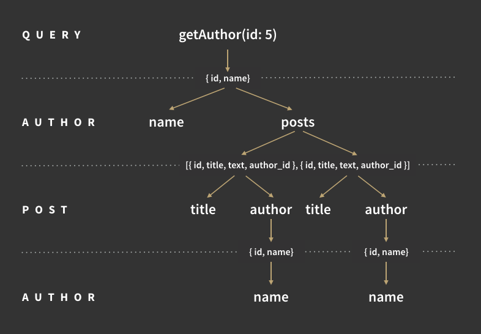

<!--
****WELCOME****

Welcome. Thanks everyone for coming to this CharlestonJS Meetup. I hope everyone got along okay with parking.

Yea, this talk is about GraphQL and more specifically a library you may have heard about or used called Dataloader.

- Ask for hands on who has used GraphQL
- Ask for hands on who has used Dataloader

- Ask for hands on who has used Promises (Okay, then this will be easy)

I'll first give a brief refresher on GraphQL, specifically how resolvers work, arrive at some use cases for Dataloader, and then incorporate Dataloader into a GraphQL server (may the demo gods be with us)
-->

&
`dataloader`
# **GraphQL & Dataloader**
---


<!--
***INTRO***

So first brief introduction. My name is Tyler Hall. I might one of the few Charleston Natives. I'm part of the Somo Charleston Development team as a Technical Architect where I have been spending the last year building loads of GraphQL services using tools like

- Node
- TypeScript
- The Apollo Suite

We build and maintain over 20 microservices for Audi's. During this time, i've seen a couple different patterns for building GraphQL services. I hope to share with you some of the pitfalls we fell into, and what we learned.
-->
Tyler

*Technical Architect* @ Somo

---


<!-- And some quick disclaimers. There are lots of ways to build with and use GraphQL. This is just one way to do it. These are my opinions, so do what you will with them. Enough of that, let's move on. -->
## **Disclaimer**


- This is just one way to build with GraphQL
- There are lots of ways
- Take my opinions for what you will

---


<!--
***GraphQL Intro***

So GraphQL a brief refresher. GraphQL is tool that we can use to build clear, declarative APIs for fetching data. We do this by defining a set of Type Definitions, and then a set of resolvers to fulfill requests for those types.
-->


### **GraphQL**
---


<!--
***TYPEDEFS***

Here's what some typeDefs in JavaScript look like
-->

---

**Here are some type definitions**

---


<!--
***RESOLVERS***

And here's what a resolver might look like

- First argument is the what was returned from the parent resolver
- Second is args provided directly to this field
- Third is context that is passed to every GraphQL resolver
- Fourth is the info field that contains metadata about the call
-->

---

**And here is a resolver**

---


<!--
Let's focus on the resolver. How does GraphQL define a resolver?
-->

## **GraphQL Resolver** ##

"A function that resolves a value for a type or field in a schema"

---


<!--
Resolvers are executed by the GraphQL runtime, following a small set of rules

- explain the the rules

Bascially GraphQL is going to run your resolvers as a tree, resolving non-leaf nodes fully
and recursing until leaf nodes are found. When GraphQL receives an object from a resolver, it will look for subsequent child resolvers to execute to resolver the fields of the GQL type you are trying to resolve
-->
### **Resolver Rules**

- Resolvers are executed breadth-firstly
  - Siblings are executed in parallel
  - A Child is excuted only after it's parent resolves
- If an object is returned, then execution continues to the next child field
- If a scalar is returned, execution completes

---
Query Resolution



---
<!-- The important thing to intuit from this is that GraphQL queries always end at scalar values -->
GraphQL query execution _always_ ends when resolvers return a scalar or null value

---

<!--
So where does dataloader come in?

DataLoader is a generic utility to be used as part of your application's data fetching layer to provide a simplified and consistent API over various remote data sources such as databases or web services via batching and caching.

-->

`dataloader`
---

---
<!-- 
So a dataloader accepts a batching function on instantiation that recevies a single argument that is an array. That function should return an array of the same length where each indicy in the resultant array corresponds to the indicy in the provided array

Keep dataloader in the back of your mind as we are walking through the server
-->
```javascript
function batchLoadingFn (ids) {
  return Promise.all(
    ids.map(id => findById(id))
  )
}

const dataloader = new Dataloader(batchLoadingFn)

dataloader.load('id1').then(...)
dataloader.load('id2').then(...)
dataloader.load('id1').then(...)

// process.nextTick: batchLoadingFn(['id1', 'id2'])
```

- Accepts an Array
- Returns a Promise that resolves to an Array
- Array orders must match each other!

---

<!--
Alright so let's write some code. I've written a little GraphQL server, backed by a datastore

make some queries

So hold on, I told you earlier that GraphQL queries end at scalars, and yet this resolver is returning an object, and I have no other resolvers defined. What's going on? This is such a common use case, a parent resolver returning data that matches the shape of it's child fields, that GraphQL.js gives you these resolvers out of the box. These are known as "default resolvers" and it saves us a lot of time when spinning up a GraphQL server.
-->
## **Code Time**
May the demo gods be with us

---

<!--
So this is basically what is being given to you under the hood when you don't define resolvers for a type's fields

So let's take advantage of some of the power of GraphQL. When I query posts I would like to also be able to return the Tags for that post. Let's implement this.
-->
## **The Default Resolver**

```javascript
const resolvers = {
  SomeTypeWithNoResolversDefined: {
    // GraphQL.js adds all of these for you
    id: ({ id }) => id,
    name: ({ name }) => name,
    age: ({ age }) => age
    ...
  }
}
```

---
<!--
Well why don't we just eagerly load the Tags from the database? Let's do it.

Implement it
- highlight the ORM syntax and to not pay attention to it
- pay attention to queries being fired

Query.js
  db.Post.findAll({
    include: [{ model: db.Tag, as: 'tags' }]
  })

Cool so I can now see the tags coming back on my response. No extra resolvers, just one extra line, easy.
Can anybody see what's not so great about this approach?

Well if the user doesn't query for Tags, or title, or text, i'm now loading unnecessary data. This also sets a bad precedent for any other associations we would like to load as part of the Posts query. Eagerly loading can be costly. I call this approach the "Bloated Parent"
-->
Scenario 1: Eagely load the Tags

---

<!--
Could we approach this another way? Of course! GraphQL is powerful and we can set resolvers at any lvl of the resolver tree and GraphQL will always execute them.
-->


---
Scenario 1: Eagely load the Tags
- Pros
  - No Extra Resolver
  - One Query
  - Quick
- Cons
  - Potentially loading unecessary data!
  - One Query (could bog down the datasource)
  - Sets a bad precendent

---
<!--
So another approach we can take is to instead load the Tags in the field lvl resolver. Let's implement that and see what we get.

Implement it.

Post.js
  export const resolvers = {
    Post: {
      tags: ({ id }, args, { db }) => db.Tag.findAll({
        include: [{
          model: db.Post,
          as: 'posts',
          where: { id }
        }]
      })
    }
  }

Okay so this is better. Now we are only loading tags if the user queries for them. Can anybody see what is not so great about this approach?

Looks the queries on the DB. We are fetching the same Tag potentially multiple times. What if I have 10000 posts each with 2 or 3 tags? I could be loading the same tag thousands of times!
-->
Scenario 2: Load Tags in field lvl resolver

---
<!--
The biggest hit we are getting is all those repeated calls to the DB for the same Tags. Can we make it better? Of course! This is where our first use case for dataloader comes in.
-->
Scenario 2: Load Tags in field lvl resolver

- Pros
  - Only load Tags, when  queried
- Cons
  - Could fetch the same Tag multiple times
  - Still loading unnecessary (though arguably not as bad as #1)

---
<!--
Why don't we use Dataloader to get rid of all those extra roundtrips to the DB for Tags? Then call into our dataloader instead of our DB model to load the Tags. Before we implement it, let's look at what a we will be transforming. We will be taking an array of postIds and returning a list of lists of Tags for each Post. This doesn't mean that's how we have to load the data, the function just has to return it in that shape. Let's implement it and you'll see what I mean
-->
`dataloader` use case #1: Dedupe the Tags

---

<!--

Implement It.

  dataloader/index.js

      import { tagByPostId, tagById } from './TagDataloader'
      import { postById } from './PostDataloader'

      const attachDataloadersToContext = (context, acc) => {
        const newGuy = {
          ...acc
        }

        // pass reference to context
        newGuy.dataloaders = {
          tagByPostId: tagByPostId(newGuy)
        }

        return newGuy
      }

      export {
        attachDataloadersToContext,
        tagByPostId
      }


  dataloader/TagDataloader.js
      import { Op } from 'sequelize'

      import DataLoader from 'dataloader'

      import { Tag, Post } from '../db'

      export const tagByPostId = () => new DataLoader(async postIds => {
        const tags = await Tag.findAll({
          include: [{
            model: Post,
            as: 'posts',
            where: {
              id: {
                [Op.in]: postIds
              }
            }
          }]
        })

        return postIds.map(postId =>
          tags.filter(tag =>
            tag.posts.find(post => post.id === postId)
          )
        )
      })

  Post.js
    export const resolvers = {
      Post: {
        tags: async ({ id }, args, { dataloaders }) => {
          console.log(`loading tags for Post with id ${id}`)
          return dataloaders.tagByPostId.load(id)
        }
      }
    }

  main.js
    import { attachDataloadersToContext } from './dataloader'

So now you can see that our Dataloader is batching requests to our DB. Instead of a query for each Post,we now get a single query to load all Tags for all Posts. We also are only fetching each Tag once. Win Win!

This is definitely better to me. The code reads about the same and we also have better performance. But something still sticks out to me about this approach and approach #1

---
What if I there is another relation to Tags? Perhaps Posts can have comments and those Comments can also have Tags. That means I have two ways to resolve Tags and I must define two resolvers to load the tags _and_ more importantly also load the correct fields on those tags, such to satisfy my query. There is only one field now, but more complex types can have dozens of fields.

What if we added associations to Tags that could also be queried on it's type? We'd have to update all of those resolvers with the code on how to load that association in that context and only when that association is queried.

Some more simple examples: what if I wanted to always uppercase the Tag text? What if I had computed fields on Tag?
-->
Array of Post Ids => Array of Arrays of Tags per Post

`[1, 2, 3]` => `[ [Tag], [Tag, Tag, Tag], [Tag] ]`

---

<!--
I call this Waterfall type resolution and it's of the things that default resolvers gain you. Out of the box it can be pretty useful for getting spun up really quickly with a GraphQL server. But as your Graph expands to dozens or maybe even hundreds of types, each type with multiple paths that they can be queried, tracing how each field on that type is resolved can become a nightmare to track and also a nightmare to refactor and iterate on.

We want code that is easy to reason about and easy to test in isolation. Can we solve this?

Well one of the powers of GraphQL is that it allows us to constrain how it resolves fields. What I mean by that is that GraphQL will _always_ execute resolvers we give to it, _even_ if the parent resolver returns data that matches the shape of the child
-->
1. Waterfall type resolution
2. Multiple _disconnected_ ways to resolve a single type

---


---
<!--
So here is what we will do:

Why don't we try fetching our data at each field lvl resolver? Accepting minimal data from it's parent, usually just an Id of some sort. Lets implement it.

Implement It.
-->

### What we will do

- Each field has a resolver
- Each field fetches it's own data
- If the field:
  - is a scalar, return the scalar
  - is another type, return the **identifier** of that type
    - The parent arg in all child resolvers!

---
<!--
What we should end of with is a bunch of tiny tiny resolvers, all located close to their siblings
-->


---

<!--
Whoa look at all of these queries on the DB. This is the worst performance that we are seen so far. Lets just look at the code on it own, though. This code is very easy to reason about. I can look at a resolver and know exactly what data it is fetching, without having to go find it's parent. I see what it does with the data, and what it returns.

This code is very easy to test in isolation, but it isn't performant.

Can we make it performant?
-->
 Scenario 3: fetch data at field lvl resolvers

---
<!--
Dataloader can be used to augment our entire data fetching layer. Let's implement dataloaders for each model and use those in lieu of our DB models

Implement it.
- mention priming dataloaders
- mention referencing dataloaders from others


So what do we get from this? Well this code is easy to reason about, and easy to test. Each field lvl resolver can be tested in isolation as tiny function. It's also performant.

Here is the biggest benefit that we get from refactoring our schema like this:
-->
`dataloader` use case #2: Dedupe all the things

---
<!--
We are highly leveraging GraphQLs potential here. Because our root fields are just thin wrappers around our types and those are just thin wrappers around field resolvers, we can quickly expand our GraphQL query api and write almost no extra code; just add the top lvl query resolver to set the parent and that's it. Your type resolvers handle all of the work in a performant way. Anddddd **our types resolve in the same way, every time, which means we cache even further for even greater performance gains**. Holy wow.

By using dataloader, we are embracing GraphQL and leveraging it's power.

So to recep, we went over how GraphQL resolvers actually work, ending at the scalar lvl, writing your service to take advantage of that fact, and then rounding out that implementation using Dataloader to batch and dedupe requests to our datalayer. This results in code that is testable, extensible, and covers a vast amount of use cases. When we write GraphQL like this, we are able to more fully embrace the power of GraphQL. Thanks very much.
-->

Become One With The Graph

(by using `dataloader`)

---


End
